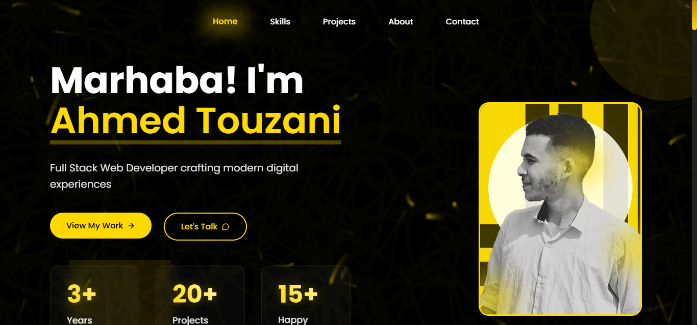

# 🌐 Ahmed Touzani's Portfolio

> A modern, captivating portfolio website that showcases my journey as a Full Stack Developer. Built with passion using HTML, CSS, and JavaScript, featuring an elegant design that blends contemporary aesthetics with Moroccan cultural elements.

[](https://ahmedtouzani.com)

## ✨ Key Features

- **Stunning UI/UX**
  - Clean, minimalist design with thoughtful animations
  - Intuitive navigation and seamless user experience
  - Dark/Light mode toggle for comfortable viewing

- **Interactive Elements**
  - 🦸‍♂️ Dynamic hero section with profile spotlight
  - 💼 Project showcase with live demos
  - 🎯 Skills matrix with progress indicators
  - 📬 Smart contact form with real-time validation

- **Cultural Integration**
  - Moroccan-inspired patterns and motifs
  - Elegant color palette with gold accents
  - Bilingual support (English/Arabic)

- **Technical Excellence**
  - 📱 Fully responsive across all devices
  - ⚡ Optimized performance (90+ Lighthouse score)
  - 🔒 Security best practices implemented
  - 📊 Analytics integration

## 🛠️ Tech Stack

### Frontend
- HTML5 & CSS3 (Flexbox, Grid, Custom Properties)
- JavaScript (ES6+)
- AOS (Animate On Scroll)
- SweetAlert2

### Integrations
- EmailJS for contact functionality
- Font Awesome icons
- Google Fonts
- Google Analytics

## 🚀 Quick Start

1. Clone the repository:
```bash
git clone https://github.com/ahmedtouzani/portfolio.git
```

2. Navigate to project:
```bash
cd portfolio
```

3. Launch locally:
- Open `index.html` in your browser, or
- Use a local server (recommended):
  ```bash
  npx serve
  ```

## ⚙️ Configuration

### EmailJS Setup
1. Sign up at [EmailJS](https://www.emailjs.com/)
2. Create an email service
3. Set up your email template
4. Configure in `main.js`:
   ```javascript
   emailjs.init("YOUR_PUBLIC_KEY");
   ```

### Analytics Setup
1. Create a Google Analytics account
2. Add your tracking ID to `index.html`

## 📱 Mobile Support

The portfolio is optimized for:
- iOS/Android devices
- Tablets
- Desktop/Laptop screens

## 🤝 Contributing

Feedback and contributions are welcome! To contribute:

1. Fork the repository
2. Create your feature branch (`git checkout -b feature/AmazingFeature`)
3. Commit changes (`git commit -m 'Add AmazingFeature'`)
4. Push to branch (`git push origin feature/AmazingFeature`)
5. Open a Pull Request

## 📄 License

This project is licensed under the MIT License - see the [LICENSE](LICENSE) file for details.

## 📬 Contact

Ahmed Touzani - [@AhmedTouzani](https://twitter.com/ahmed_touzani48) - touzaniahmed39@email.com

Project Link: [https://github.com/ahmedtouzani/portfolio](https://github.com/ahmedtouzani/portfolio)

---

<p align="center">Made with ❤️ in Morocco</p>
